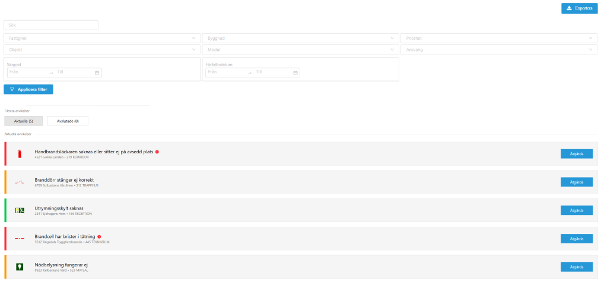
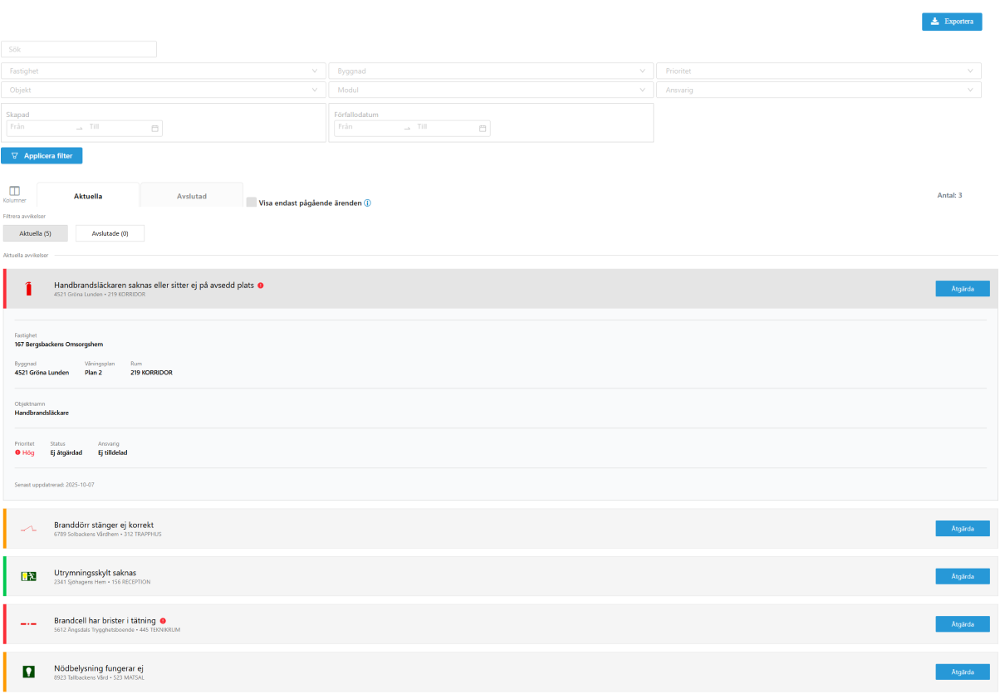

# Frontend Test

## Setup
npm install  
npm run dev  

## Tech stack
- React
- TypeScript
- Vite
- Tailwind CSS

## Screenshots
Försökt illustrera hur min lösning ser ut inuti Yta.

- Utan dropdown

- Med dropdown

## UX-överväganden

Jag har försökt hålla fokus på det viktigaste i listan och undvika att gå in i för många detaljer här, eftersom det är något jag gärna utvecklar muntligt vid intervjun.

### Mål
Målet var att hålla designen tillräckligt nära den befintliga så att den känns igen i sitt sammanhang, men samtidigt avvika och följa mitt eget formspråk och min egen struktur.

Jag har medvetet velat lätta på informationsmängden och göra innehållet mer lättläst. Varje objekt i listan ska besvara ett begränsat antal frågor, och därför ska varje rad inte innehålla mer information än vad som behövs i det primära läget.

Min version innehåller mer tomrum och lägger större visuell vikt på vänster sida, vilket möjliggör snabbare och enklare avskanning, särskilt i scenarier där listan är lång.

### Utgångspunkt
Hela listan är uppbyggd kring att snabbt besvara följande frågor:

- Vad gäller avvikelsen?
- Var i byggnaden finns den?
- Hur viktig är den?
- Är den åtgärdad eller inte?

### Primärt kort
Det primära kortet besvarar dessa frågor genom **avvikelsens namn**, **byggnadens namn** och **rummets namn**, vilket var de obligatoriska attributen.

Utöver detta har jag lagt till en **färglist** som prioriteringsindikator, en **ikon** för att ge en tydligare helhetsbild samt en **åtgärda-knapp**. Eftersom åtgärd är huvudhandlingen i listan ska den vara snabbt tillgänglig, samtidigt som knappen visuellt bekräftar att avvikelsen ännu inte är åtgärdad.

### Sekundär dropdown
Den sekundära dropdownen besvarar samma frågor, men i mer detalj.

Den första sektionen innehåller en **upprepning av platsinformationen** tillsammans med **fastighet** och **våningsplan**. Detta samlar all nödvändig platskontext på ett ställe utan att användaren behöver referera tillbaka till det primära kortet.

**Objektets namn** visas separat för att tydliggöra vilket objekt avvikelsen gäller.

### Ärendestatus
Nästa sektion samlar all information kring ärendestatus. Här visas **prioritet med färgmarkering** för att behålla kopplingen till färglisten i listvyn, tillsammans med **aktuell status** och **ansvarig**.

### Datum
Längst ner visas **datum** för senaste uppdatering, eftersom det är den mest relevanta tidsinformationen för uppföljning av ärendet (istället för att visa datumet då avvikelsen skapades).

Detta är vad uppgiften främst gick ut på. Ni kanske även vill höra mer specifika motiveringar kring enskilda UX-detaljer, men för att hålla denna README i en rimlig längd sparar vi detaljerna till måndag.
